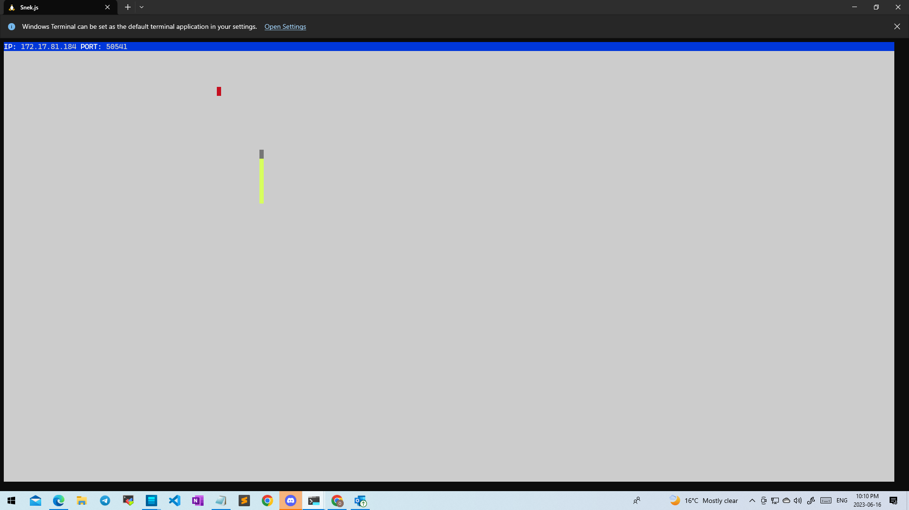

# Snake Client Project

Snake game is a very popular video game. It is a video game concept where the player maneuvers a dot and grows it by 'eating' pieces of food. As it moves and eats, it grows, and the growing snake becomes an obstacle to smooth maneuvers. The goal is to grow it to become as big as possible without bumping into the side walls or bumping into itself, upon which it dies.

This project is a multiplayer take on the Snake game genre.

## Final Product

## Getting Started

To get started, you need to have the server side up and running. Follow the steps below:

1. Download and install the Snake Server from the [snake-client](https://github.com/Giftojcs/snake-client.git).
2. Start the server according to the provided instructions.

Once the server is running, you can run the Snake Client using the following steps:

1. Clone this repository to your local machine using the command:
2. Navigate to the project directory:
3. Install the dependencies using npm:
4. Run the Snake Client using the command:

Enjoy playing the Snake game with multiple players!
